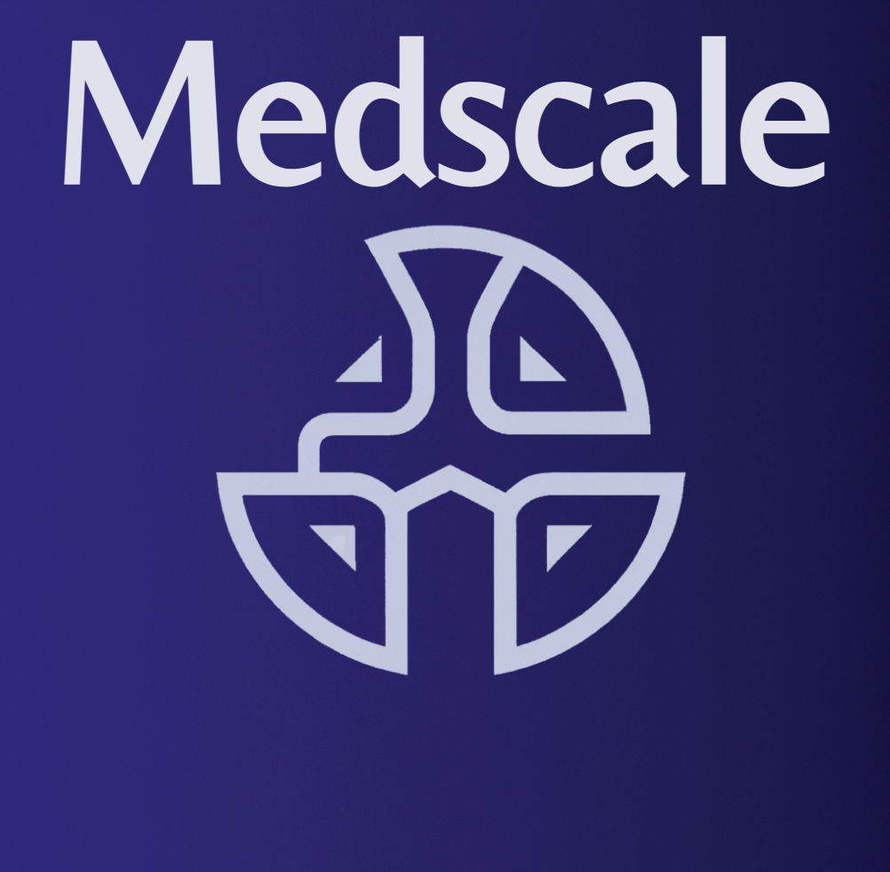

<!-- <h1 align="center" style = font-size: 200px>MedScale</h1> -->
<h1 align="center">
    
</h1> 
 


[](https://medscale.me/)
 
Medscale is an attempt to build a medical software based on pipelines of Federated Scope platform. Our goal is to create an intelligent, secure, and reliable platform for medical applications with features to protect data privacy, improve data analysis and interpretation, and facilitate interoperability between healthcare systems and multiple cloud platforms.

The features of Medscale include support for multi-center clinical trials, data privacy enforcement, automated anomaly detection, and tools for data interpretation and visualization. Currently, the project is in its early stages, and our team is working hard to implement these features and ensure that the platform meets the high standards of data security and performance required for medical applications.

A detailed tutorial is provided on our website: [medscale.me](https://medscale.me/).
 
You can try MedScale via [MedScale Playground](https://try.medscale.me/) or [Google Colab](https://colab.research.google.com/github/medscale/MedScale/).
 

| [Code Structure](#code-structure) | [Quick Start](#quick-start) | [Advanced](#advanced) | [Documentation](#documentation) | [Publications](#publications) | [Contributing](#contributing) | 

## Quick Start for Medscale

We provide an end-to-end example for users to start running a medical course with Medscale.

### Step 1. Installation

First of all, users need to clone the source code and install the required packages (we suggest python version >= 3.9). You can choose between the following two installation methods (via docker or conda) to install Medscale.

```bash
git clone https://github.com/medscale/medscale.me.git
cd medscale.me
```

#### Use Conda

We recommend using a new virtual environment to install Medscale:

```bash
conda create -n ms python=3.9
conda activate ms
```

If your backend is torch, please install torch in advance ([torch-get-started](https://pytorch.org/get-started/locally/)). For example, if your cuda version is 11.3 please execute the following command:

```bash
conda install -y pytorch=1.10.1 torchvision=0.11.2 torchaudio=0.10.1 torchtext=0.11.1 cudatoolkit=11.3 -c pytorch -c conda-forge
```

For users with Apple M1 chips:
```bash
conda install pytorch torchvision torchaudio -c pytorch
# Downgrade torchvision to avoid segmentation fault
python -m pip install torchvision==0.11.3
```

Finally, after the backend is installed, you can install Medscale from `source`:

##### From source

```bash
pip install .

# Or (for dev mode)
pip install -e .[dev]
pre-commit install
```

Now, you have successfully installed the minimal version of Medscale. (**Optinal**) For additional packages, run:

```bash
bash environment/extra_dependencies_torch1.10-medscale.sh
```

Finally, after the backend is installed, you can install FederatedScope from `source`:

##### From source

```bash
pip install .

# Or (for dev mode)
pip install -e .[dev]
pre-commit install
```
 ## Example Usage

### Downloading Lung cancer dataset

You can download lung cancer dataset from kaggle and put it in 'dataset' repository.
### Running training script
```bash
# Or (for dev mode)
pip install -e .[dev]
pre-commit install
```
To run a federated learning example with `FedOPT` algorithm, for unbalanced dataset run:
```bash 
python federatedscope/main.py --cfg scripts/my_configs/FedOPT_Lung_cancer.yaml
```
All adjustable parameters can be found in the second cell. Careful with the `BATCH_SIZE`, as we are using it to parallelize head and time chunk calculations.

To run a federated learning example with `Fedem` algorithm, for unbalanced dataset run:
```bash 
python federatedscope/main.py --cfg scripts/my_configs/fedem_Lung_cancer.yaml
```
For a personalized , improved method you can run:
```bash 
python federatedscope/main.py --cfg scripts/my_configs/pfedme_lung_cancer.yaml
```


## License

Our work is under MIT license. Credits to  <a href="https://arxiv.org/abs/2204.05011" target="_blank">Federated Scope</a>   for their amazing pipeline.
 
