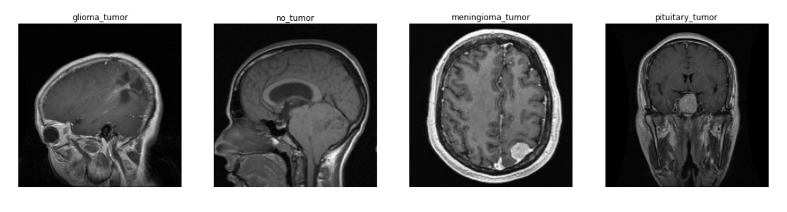

<!-- <h1 align="center" style = font-size: 200px>MedScale</h1> -->
<h1 align="center">
    
</h1> 
 


[](https://medscale.me/)
 
Medscale is an attempt to build a medical software based on pipelines of Federated Scope platform. Our goal is to create an intelligent, secure, and reliable platform for medical applications with features to protect data privacy, improve data analysis and interpretation, and facilitate interoperability between healthcare systems and multiple cloud platforms.

The features of Medscale include support for multi-center clinical trials, data privacy enforcement, automated anomaly detection, and tools for data interpretation and visualization. Currently, the project is in its early stages, and our team is working hard to implement these features and ensure that the platform meets the high standards of data security and performance required for medical applications.

A detailed tutorial will be provided on our website: [medscale.me](https://medscale.me/) (Under construction)
 
You can try MedScale via [MedScale Playground](https://try.medscale.me/) or [Google Colab](https://colab.research.google.com/github/medscale/MedScale/).
 

| [Code Structure](#code-structure) | [Quick Start](#quick-start) | [Advanced](#advanced) | [Documentation](#documentation) | [Publications](#publications) | [Contributing](#contributing) | 

## Quick Start for Medscale🚀

We provide an end-to-end example for users to start running a medical course with Medscale.

### Step 1. Installation📚

First of all, users need to clone the source code and install the required packages (we suggest python version >= 3.9). You can choose between the following two installation methods (via docker or conda) to install Medscale.

```bash
git clone https://github.com/erfandarzi/medscale.git
=======

cd medscale
```

#### Use Conda

We recommend using a new virtual environment to install Medscale:

```bash
conda create -n ms python=3.9
conda activate ms
```

If your backend is torch, please install torch in advance ([torch-get-started](https://pytorch.org/get-started/locally/)). For example, if your cuda version is 11.3 please execute the following command:

```bash
conda install -y pytorch=1.10.1 torchvision=0.11.2 torchaudio=0.10.1 torchtext=0.11.1 cudatoolkit=11.3 -c pytorch -c conda-forge
```

For users with Apple M1 chips💻:
```bash
conda install pytorch torchvision torchaudio -c pytorch
# Downgrade torchvision to avoid segmentation fault
python -m pip install torchvision==0.11.3
```

Finally, after the backend is installed, you can install Medscale from `source`:

##### From source

```bash
pip install .

# Or (for dev mode)
pip install -e .[dev]
pre-commit install
```

Now, you have successfully installed the minimal version of Medscale. (**Optinal**) For additional packages, run:

```bash
bash environment/extra_dependencies_torch1.10-medscale.sh
```

Finally, after the backend is installed, you can install medscale from `source`:

##### From source

```bash
pip install .

# Or (for dev mode)
pip install -e .[dev]
pre-commit install
```
 ## Example Usage: Federated lung cancer classification 
<h1 align="center">
    
</h1> 

### Downloading Lung cancer dataset📋

You can download lung cancer dataset from kaggle and put it in `dataset/lung`  directory.


 
### Running training script
 
To run a federated learning example with `FedOPT` algorithm, for unbalanced dataset run:
```bash 
<<<<<<< HEAD
python medscale/main.py --cfg scripts/my_configs/FedOPT_Lung_cancer.yaml
=======
<<<<<<< HEAD
python medscale/main.py --cfg scripts/my_configs/FedOPT_Lung_cancer.yaml
=======
python medscale/main.py --cfg scripts/my_configs/FedOPT_Lung_cancer.yaml
>>>>>>> fe4962455354c9c11afd9c9806ceda28eb280737
>>>>>>> 64b283ee525ef53c32509882719e74890329b83f
```
All adjustable parameters can be found in the second cell. Careful with the `BATCH_SIZE`, as we are using it to parallelize head and time chunk calculations.

To run a federated learning example with `Fedem` algorithm, for unbalanced dataset run:
```bash 
<<<<<<< HEAD
=======
<<<<<<< HEAD
>>>>>>> 64b283ee525ef53c32509882719e74890329b83f
python medscale/main.py --cfg scripts/my_configs/fedem_Lung_cancer.yaml
```
For a personalized , improved method you can run:
```bash 
python medscale/main.py --cfg scripts/my_configs/pfedme_lung_cancer.yaml
<<<<<<< HEAD
=======
=======
python medscale/main.py --cfg scripts/my_configs/fedem_Lung_cancer.yaml
```
For a personalized , improved method you can run:
```bash 
python medscale/main.py --cfg scripts/my_configs/pfedme_lung_cancer.yaml
>>>>>>> fe4962455354c9c11afd9c9806ceda28eb280737
>>>>>>> 64b283ee525ef53c32509882719e74890329b83f
```

 ## Example Usage: Federated  brain MRI tumor detection 
### Downloading brain MRI tumor dataset📋

You can download brain MRI tumor dataset from kaggle and put it in `dataset/MRI`  directory. 

<h1 align="center">
    
</h1> 
 
You can put as many MRI data samples in the directory. Download Kaggle datasets and BrainDevelopment.org: [Kaggle 2018](https://www.kaggle.com/navoneel/brain-mri-images-for-brain-tumor-detection), [Kaggle 2020](https://www.kaggle.com/sartajbhuvaji/brain-tumor-classification-mri),Some types of brain tissue are more visible under contrast material and others propagate magnetization differently.
           Proton Density Scan            |  Transverse Magnetization (Type 2) Scan
:----------------------------------------:|:----------------------------------------:
    | 


### Running training script

To run a federated learning example with `FedOPT` algorithm, for unbalanced dataset run:
```bash 
<<<<<<< HEAD
python medscale/main.py --cfg scripts/my_configs/FedOPT_MRI.yaml
=======
<<<<<<< HEAD
python medscale/main.py --cfg scripts/my_configs/FedOPT_MRI.yaml
=======
python medscale/main.py --cfg scripts/my_configs/FedOPT_MRI.yaml
>>>>>>> fe4962455354c9c11afd9c9806ceda28eb280737
>>>>>>> 64b283ee525ef53c32509882719e74890329b83f
```
All adjustable parameters can be found in the second cell. Careful with the `BATCH_SIZE`, as we are using it to parallelize head and time chunk calculations.

To run a federated learning example with `Fedem` algorithm, for unbalanced dataset run:
```bash 
<<<<<<< HEAD
=======
<<<<<<< HEAD
>>>>>>> 64b283ee525ef53c32509882719e74890329b83f
python medscale/main.py --cfg scripts/my_configs/fedem_MRI.yaml
```
For a personalized , improved method you can run:
```bash 
python medscale/main.py --cfg scripts/my_configs/pfedme_MRI.yaml
<<<<<<< HEAD
=======
=======
python medscale/main.py --cfg scripts/my_configs/fedem_MRI.yaml
```
For a personalized , improved method you can run:
```bash 
python medscale/main.py --cfg scripts/my_configs/pfedme_MRI.yaml
>>>>>>> fe4962455354c9c11afd9c9806ceda28eb280737
>>>>>>> 64b283ee525ef53c32509882719e74890329b83f
```
## XNAT support to federated pipelines

To add `XNAT` support to the federated learning pipeline, you can use a modified version of XNAT that is optimized and customized for Ubuntu. We recommend you to download the installation script from the [Xnat-Ubuntu](http://github.com/NrgXnat/xnat-docker-compose) repository. After downloading the file, copy it to the root directory of the Ubuntu server and execute it with the command:
```bash 
 sudo bash installScript.sh
 ```
This will start the installation process and configure the processing URL and password in the XNAT admin settings.
 
To enable pipelines in your XNAT system, you must add them and configure the container service for external docker environments. First, navigate to` Administer --> Data Types`

```bash 
 cd Administer/Data Types
 ```
 
  and click on the element for which you want to enable the Execute option. Scroll down to Available Report Actions and add `PipelineScreen_launch_pipeline` and `Build` to the last entry. After submitting this configuration, a 'Execute Pipeline' button should appear when you open a project with the specific SessionData Element. You can now execute a Pipeline for the Project Data. To add a sample pipeline, navigate to `Administer --> Pipeline --> Add Pipeline`
  
  ```bash 
 cd Administer/Pipeline/AddPipeline
 ```
 
  and enter the path `/data/xnat/pipeline/catalog/PipelineTest/SampleHelloWorldPipeline.xml ` Make sure to leave the Name Textfield empty to avoid any bugs! After confirming your settings, the Pipeline will be added to your project, allowing you to test the pipeline engine.
 
The Container Service allows you to add docker containers as pipelines. This requires an external `docker` environment. To connect to this environment, you need to setup a network and configure the communication between the main host and the dockerized XNAT. Finally, you can execute the Pipeline test script to ensure that everything is working as expected.


## License

Our work is under MIT license. Credits to  <a href="https://arxiv.org/abs/2204.05011" target="_blank">Federated Scope</a>   for their amazing pipeline.
 
